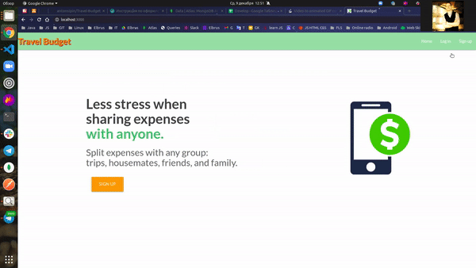
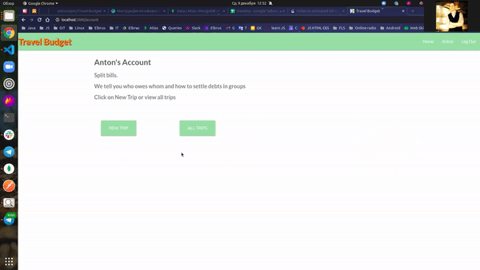
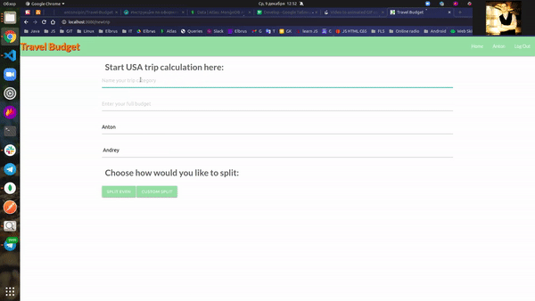
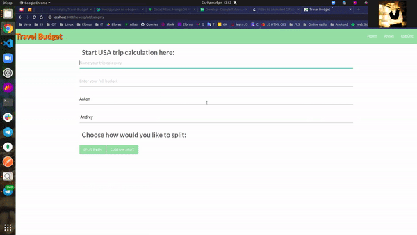
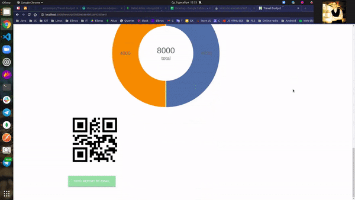

# Travel-Budget

<b>
Travel Badget is a project for a customer. This is an application for conducting convenient settlements with friends while traveling. While traveling in the app, you need to keep a short note of expenses, for example "Transfer" or "Flights" and indicate the participants. At the end of the trip, the application will generate a detailed report on expenses during the trip and even display it in the form of diagrams, which can then be sent by Email to any participant in the trip.
</b>  

<h3>
 Technologies used: HTML, CSS, JavaScript, MongoDB Cluster, Handlebars, Mongoose, Express, Node.js, Material-UI, Nodemailer, REST API, Adaptive layout.
 </h3>
 <h3>
   How to start the app locally:
   </h3>
  

  <ul>
    <li>
      Clone this repo <b><i> git clone git@github.com:antonsipin/Travel-Budget.git</i></b>
    </li>
    <li>
      Install the dependencies <b><i> npm install </i></b>
    </li>
    <li>
     Place the <b>.env</b> file in the root directory (you can get it from me or take a look at <b>.envexample</b> file)
    </li>
    <li>
      Run the app <b><i> npm start </i></b> (The app starts at http://localhost:3000. Open this link in browser and you will be able to test the app)
    </li>
  </ul>
  

  
<h3 align="center">
  
Authorization:
 
   
  
Adding a trip:
 
   
  
Adding an expense category:
 
   
  
Editing an expense category:
 
   
  
Post-trip report:
 
   
  
Automatic email report sending:
 
   
 </h3>
